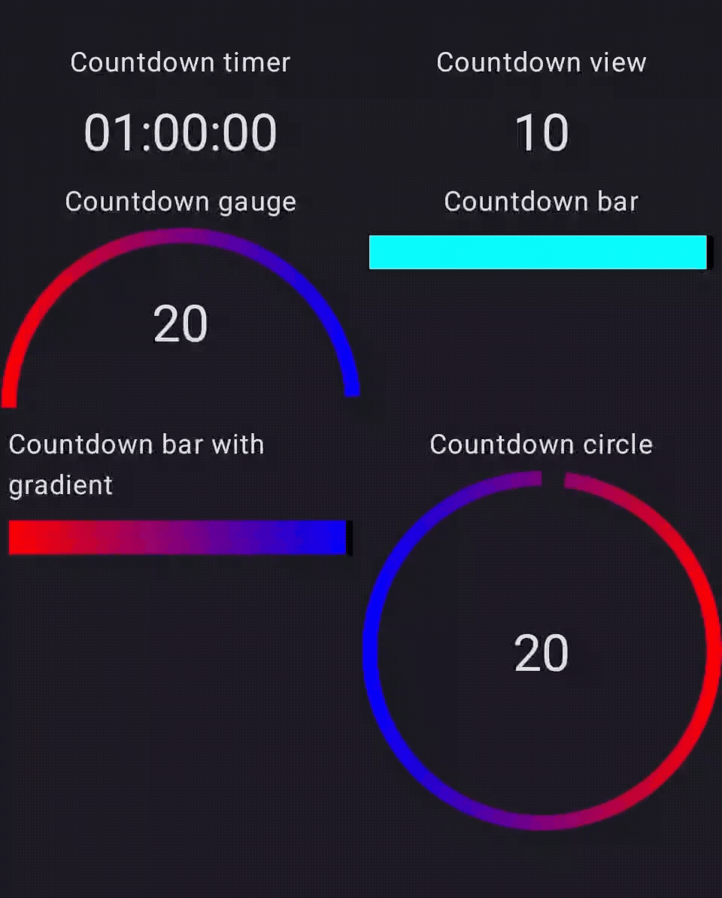

A versatile and lifecycle-aware countdown timer View for Android. Countdownviews provides a highly customizable and easy-to-integrate component for displaying timers, stopwatches, or any form of descending time counter in your application with minimal boilerplate. Built for performance and reliability, it handles the complexities of Android lifecycles automatically, ensuring your timers are always accurate and resource-efficient.

# Showcase
A visual demonstration is the most effective way to understand the capabilities of a UI library. The following animation showcases various styles, formats, and the smooth operation of the countdown timer.



Core Features
Highly Customizable: Easily tailor the timer's appearance, including text color, size, and font, using compose parameters


Simple 
Lightweight & Performant: Built with performance in mind to ensure minimal impact on your app's UI thread and prevent UI jank.


## Installation
To integrate Countdownviews into your Android project, add the following dependency to your build.gradle or build.gradle.kts file. The library is distributed via Maven Central.   

First, ensure that mavenCentral() is included in your project's settings.gradle or root build.gradle file:

Add the following to your module-level build.gradle file:
```gradle
// settings.gradle
dependencyResolutionManagement {
    repositories {
        google()
        mavenCentral()
    }
}
```

Next, add the library dependency. Use the latest version number indicated by the badge at the top of this document.


Add the following dependency to your app-level build.gradle file:
```gradle
dependencies {
    implementation 'io.github.vasuthakker:countdownviews:1.0.0' // Replace with the latest version
}
```

# Usage Guide

### 1. Countdown Timer
```kotlin
   CountDownTimer(
       modifier = Modifier,
       seconds = 3600,
       style = TextStyle(fontSize = 30.sp),
       onEnd = {}
   )

```

### 2. Countdown View
```kotlin
   CountDownView(
       modifier = Modifier,
       countDown = 10,
       style = TextStyle(fontSize = 30.sp)
   ) {}

```
### 3. Countdown Gauge

```kotlin
CountDownGauge(
    countDown = 20,
    brush = Brush.horizontalGradient(listOf(Color.Red, Color.Blue)),
    strokeWidth = 20f,
    smoothAnimation = true,
    isTextVisible = true,
    countDownType = CountDownType.COUNTDOWN_TEXT,
    style = TextStyle(fontSize = 30.sp),
) {}
```

### 4. Countdown Bar with colors
```kotlin
```kotlin
CountDownBar(
    modifier = Modifier.fillMaxWidth(),
    countDown = 20,
    trackColor = Color.Black,
    progressColors = ProgressbarDefaults.progressColors(
        startColor = Color.Cyan,
        midColor = Color.Magenta,
        endColor = Color.Blue
    ),
    strokeWidth = 20.dp,
    smoothAnimation = true
) {}
```

### 5. Countdown Bar with gradient

```kotlin
CountDownGauge(
    countDown = 20,
    brush = Brush.horizontalGradient(listOf(Color.Red, Color.Blue)),
    strokeWidth = 20f,
    smoothAnimation = true,
    isTextVisible = true,
    countDownType = CountDownType.COUNTDOWN_TEXT,
    style = TextStyle(fontSize = 30.sp),
) {}
```

### 6. Countdown Circle

```kotlin
CountDownCircle(
    brush = Brush.horizontalGradient(listOf(Color.Red, Color.Blue)),
    strokeWidth = 20f,
    countDown = 20,
    style = TextStyle(fontSize = 30.sp),
    smoothAnimation = true,
    modifier = Modifier,
    alignment = Alignment.Center,
    countDownType = CountDownType.SIMPLE_TEXT
) {}
```


#### Reporting Bugs
If you encounter a bug, please open an issue on GitHub. A high-quality bug report is essential for a swift resolution. The author of this library has experience reporting detailed issues on other complex projects , and this project holds contributions to the same high standard. An effective bug report should include:   

Library Version: The specific version of Countdownviews you are using.

Device and OS: The device model and Android OS version where the bug occurred (e.g., "Pixel 6, Android 12"). This is critical, as behavior can vary significantly across the Android ecosystem.   

Steps to Reproduce: A clear, step-by-step description of how to trigger the bug.

A Sample Project: A link to a minimal, reproducible sample project is the single most helpful thing you can provide.


#### Feature Requests
If you have an idea for a new feature or an enhancement to an existing one, please open an issue. Describe the feature, its use case, and why it would be a valuable addition to the library. This allows for a community discussion before any development work begins.

#### Pull Requests
Pull requests are welcome. Please adhere to the following guidelines:
Open an issue first to discuss the proposed change.
Ensure your code follows the existing style and conventions of the project.
Include relevant updates to documentation or comments in your code.
Ensure your changes do not break existing functionality.

#### License
Countdownviews is licensed under the Apache License 2.0. This is a permissive, business-friendly license widely used in the Android open-source community, including by Google for the Android Open Source Project (AOSP). This choice ensures the library can be safely and easily adopted by individual developers, startups, and large corporations without creating licensing conflicts.

### © 2025 Viral Thakker

Licensed under the Apache License, Version 2.0 (the "License");
you may not use this file except in compliance with the License.
You may obtain a copy of the License at

    http://www.apache.org/licenses/LICENSE-2.0

Unless required by applicable law or agreed to in writing, software
distributed under the License is distributed on an "AS IS" BASIS,
WITHOUTHOUT WARRANTIES OR CONDITIONS OF ANY KIND, either express or implied.
See the License for the specific language governing permissions and
limitations under the License.
